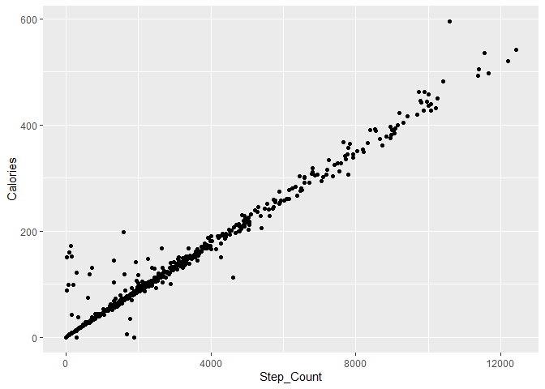

# a brief description of your past experiences, if any, of using R, RStudio, R Markdown, Git, Github, ggplot2 and dplyr

I can say that I almost do not have any past experiences in R, but I
have used Github before this course. So It is a lot of things to learn
in R for me.

# a plot, using ggplot, of some aspect of a data-set.

I use this table gotten from
“<https://www.kaggle.com/datasets/awodijitemitope/steps-count-for-fitness-journey-dataset>”.
It is a raw .csv file to record training data of a person every day. I
this plot, we can see steps and calories is almost linear correlated
with each other, which makes sense! So it proves that the more steps the
more calories are consumed.

``` r
library(tidyverse)
Steps_daily <- read_csv("Steps Export_ 3-17-21to9-23-22.csv")
ggplot(Steps_daily, aes(x=Step_Count, y=Calories))+geom_point()
```



``` r
sessionInfo()
```

    ## R version 4.2.2 (2022-10-31 ucrt)
    ## Platform: x86_64-w64-mingw32/x64 (64-bit)
    ## Running under: Windows 10 x64 (build 19044)
    ## 
    ## Matrix products: default
    ## 
    ## locale:
    ## [1] LC_COLLATE=Chinese (Simplified)_China.utf8 
    ## [2] LC_CTYPE=Chinese (Simplified)_China.utf8   
    ## [3] LC_MONETARY=Chinese (Simplified)_China.utf8
    ## [4] LC_NUMERIC=C                               
    ## [5] LC_TIME=Chinese (Simplified)_China.utf8    
    ## 
    ## attached base packages:
    ## [1] stats     graphics  grDevices utils     datasets  methods   base     
    ## 
    ## other attached packages:
    ## [1] forcats_0.5.2   stringr_1.4.1   dplyr_1.0.10    purrr_0.3.5    
    ## [5] readr_2.1.3     tidyr_1.2.1     tibble_3.1.8    ggplot2_3.4.0  
    ## [9] tidyverse_1.3.2
    ## 
    ## loaded via a namespace (and not attached):
    ##  [1] lubridate_1.9.0     assertthat_0.2.1    digest_0.6.30      
    ##  [4] utf8_1.2.2          R6_2.5.1            cellranger_1.1.0   
    ##  [7] backports_1.4.1     reprex_2.0.2        evaluate_0.18      
    ## [10] httr_1.4.4          pillar_1.8.1        rlang_1.0.6        
    ## [13] googlesheets4_1.0.1 readxl_1.4.1        rstudioapi_0.14    
    ## [16] rmarkdown_2.18      labeling_0.4.2      googledrive_2.0.0  
    ## [19] bit_4.0.4           munsell_0.5.0       broom_1.0.1        
    ## [22] compiler_4.2.2      modelr_0.1.10       xfun_0.34          
    ## [25] pkgconfig_2.0.3     htmltools_0.5.3     tidyselect_1.2.0   
    ## [28] fansi_1.0.3         crayon_1.5.2        tzdb_0.3.0         
    ## [31] dbplyr_2.2.1        withr_2.5.0         grid_4.2.2         
    ## [34] jsonlite_1.8.3      gtable_0.3.1        lifecycle_1.0.3    
    ## [37] DBI_1.1.3           magrittr_2.0.3      scales_1.2.1       
    ## [40] cli_3.4.1           stringi_1.7.8       vroom_1.6.0        
    ## [43] farver_2.1.1        fs_1.5.2            xml2_1.3.3         
    ## [46] ellipsis_0.3.2      generics_0.1.3      vctrs_0.5.0        
    ## [49] tools_4.2.2         bit64_4.0.5         glue_1.6.2         
    ## [52] hms_1.1.2           parallel_4.2.2      fastmap_1.1.0      
    ## [55] yaml_2.3.6          timechange_0.1.1    colorspace_2.0-3   
    ## [58] gargle_1.2.1        rvest_1.0.3         knitr_1.40         
    ## [61] haven_2.5.1
